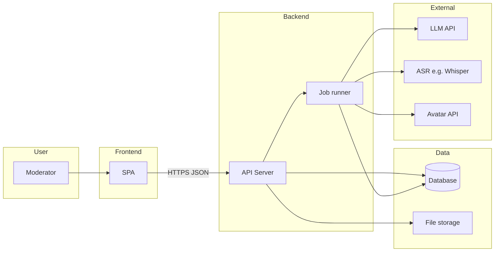

# Synthetic AI Agent-Juror for Silver Mercury — Understanding and Implementation Plan

This document sets out (1) how the task of building the synthetic AI juror is understood, and (2) a concrete plan for implementing the three parts: Core functionality, Avatar integration, and Interface. It incorporates recommendations from external reviews (Gemini, ChatGPT) on evidence fidelity, defensibility, calibration, and production readiness.

---

## Part A — How the task is understood

### Goal

Build a **synthetic member of the jury** for the Silver Mercury festival that:

- **Analyses** submitted case materials (text, presentations, video/transcripts) in line with the official methodology.
- **Scores** cases in two stages: first a longlist decision (long / not long), then criteria-based scores (1–10) with weights, leading to an award level (Gold / Silver / Bronze / Shortlist / Longlist).
- **Argues** in writing for every decision, with clear links between **evidence and scores**, so the verdict is transparent and **defensible** (auditable artefacts, no free-form “thinking” exposed).
- **Presents** the verdict in real time during jury sessions: a digital avatar announces the score and key arguments (e.g. in Zoom when the moderator shares the avatar view).

The synthetic juror must behave like a **strict, discriminative** expert: use the full score range, avoid clustering around the median, and be willing to give low scores and critical comments when justified. It is not there to encourage participants but to support consistent, methodology-aligned judging.

### Constraints and sources of truth

- **ТЗ (technical specification):** Web application; moderator interface for uploading cases and controlling the process; digital avatar that can be shown in Zoom; integration with an external avatar service and with the AI jury model; storage of scores and comments.
- **Methodology:** Two-stage judging; criteria with weights per nomination block; scale 1–10 mapped to award levels; median aggregation across judges (for the human panel); mandatory written argumentation; **anonymity and conflict-of-interest rules** (operationalised via redaction, audit logs, RBAC).
- **Historical data:** SM_2025.json and derived analyses are used for training, calibration, few-shot examples, and distribution checks — not to force a single "median" judge, but to preserve score spread and argument quality.

### Three delivery parts

1. **Part 1 — Core functionality (critical):** Analysis of submitted information, scoring (L1 + L2), and arguments supporting the scores. This is the indispensable delivery; the rest depends on it.
2. **Part 2 — Avatar:** Integration with an external avatar service (API); human-in-the-loop approval of script before video generation; async video rendering; fallback to TTS if needed.
3. **Part 3 — Interface:** Upload of case documents; display of **auditable artefacts** (evidence-linked claims, per-criterion checklist) rather than raw “thinking”; score and argument summary; frame where the avatar presents the verdict.

---

## Part A2 — Architecture (blocks, services, connections)

### Blocks of the product

| Block | What it is | What it does |
|-------|------------|--------------|
| **Frontend** | Web app (SPA) | Moderator logs in, uploads cases (form + files), triggers analysis, sees status and results (L1, L2, verdict, evidence table, rubric). Approves avatar script then triggers video. Opens “presentation” view to share in Zoom. Export, re-run. |
| **Backend (API)** | Server application | Auth and RBAC, file upload handling, ingestion (text + vision + video ASR), Evidence Index, L1/L2 (calls LLM), consistency check, strict JSON output. Exposes REST API for the frontend. Starts async jobs (analysis, avatar). |
| **Database** | Persistent store | Users, roles, cases (metadata), evaluations (scores, verdict, hashes), methodology config versions, audit logs (who uploaded, ran, viewed). |
| **File storage** | Blob storage | Uploaded files (PDF, PPTX, video); optionally generated avatar videos (or only store URLs if avatar provider hosts them). |
| **Job runner** | Background worker or queue | Runs “analyze case” and “generate avatar video” asynchronously so the API returns quickly and the frontend can poll status. |
| **Avatar provider** | External API | HeyGen / D-ID / Synthesia: we send script (and optionally voice/avatar id), they return video URL. Called from the backend. |

### How the blocks connect

- **Frontend** talks only to the **Backend API** (HTTPS, JSON). It never talks to the database or external APIs directly.
- **Backend** uses the **database** for users, cases, evaluations, audit logs; **file storage** for uploads (and optionally avatar files); a **job runner** to run analysis and avatar jobs; and **external services** (LLM, Whisper, avatar) as needed.

### Suggested services and connections

| Block | Suggested service | How it connects |
|-------|-------------------|------------------|
| **Frontend** | **Netlify** or **Vercel** | Deploy the SPA (e.g. `npm run build` then deploy `dist/`). Set **Backend API URL** in env (e.g. `VITE_API_URL=https://your-api.onrender.com`). All requests go to that URL (upload, analyze, get result, approve script, get avatar status). |
| **Backend API** | **Render** (Web Service) or **Railway** or **Fly.io** | One Node.js or Python app: REST routes, auth (JWT/session), calls to DB, file storage, and external APIs. Connects to **Database** and **File storage** via env vars (connection strings). Triggers **jobs** (in same process with a queue library, or a separate worker). CORS allows the frontend origin (e.g. `https://your-app.netlify.app`). |
| **Database** | **PostgreSQL** on **Render** / **Railway** / **Supabase**, or **Neon** | Backend gets `DATABASE_URL`. Stores users, cases, evaluations, audit_logs. No direct connection from frontend. |
| **File storage** | **Supabase Storage** or **AWS S3** (e.g. **Cloudflare R2**) or **Render disk** (simpler, less scalable) | Backend gets `STORAGE_BUCKET` / `S3_ENDPOINT` and keys. Upload handler writes files there; ingestion reads from there. Frontend never talks to storage — it sends files to the backend, backend writes to storage. |
| **Job queue** | **In-process + DB polling** (e.g. “jobs” table, worker loop) or **Redis + Bull** (e.g. Redis on **Upstash**) | Backend creates a job row (or pushes to Redis); worker (same app or separate process) picks it up, runs L1/L2 or calls avatar API, updates status. Frontend polls `GET /evaluations/:id` or `GET /jobs/:id` for status. |
| **LLM / Whisper / Vision** | **OpenAI** (or Yandex, etc.) | Backend uses API keys (env vars). Called from backend only. |
| **Avatar** | **HeyGen** or **D-ID** or **Synthesia** | Backend (or avatar adapter inside backend) uses their API; key in env. After moderator approves script, backend creates avatar job, polls provider until video URL is ready, saves URL in DB; frontend polls until “ready” then shows play button. |

**Repo layout:** `frontend/` (SPA, deploy to Netlify/Vercel) and `backend/` or `api/` (API server + ingestion + L1/L2 + avatar adapter, deploy to Render/Railway) in one repository. Database and file storage are hosted services; connection strings live in backend env. The frontend only needs the backend API base URL.

---

## Part B — Implementation plan for Part 1 (Core)

### B.1 Methodology config (first-class, versioned)

- Maintain a **versioned methodology config** as a first-class artefact:
  - **Per nomination block:** criteria list, weights, award thresholds, **anchor descriptions** for scores 2 / 5 / 8 (short text defining what “weak / adequate / strong” looks like for that block).
  - **Per block:** required evidence policy — e.g. “results required? what counts as results? acceptable proxies? if results missing → max award = shortlist vs not_long.”
  - Social/ESG blocks: explicit rule for Social outcomes + standard criteria (e.g. average of two branches).
- All scoring and hard rules read from this config so that **rules are per block**, not global. Version config and store config hash with every run for reproducibility.

### B.2 Ingestion and evidence fidelity

- **Dual-path ingestion** (do not treat PDF/PPTX as “just text”):
  - **Text path:** Extract text from PDF/PPTX; segment by slide/section.
  - **Vision path:** For slides that look like evidence (charts, tables, results, annotated visuals), render slide/image and run a **vision pass** (or heuristic classifier) so that proof in visuals is not lost. This avoids under-scoring cases whose evidence is in deck visuals.
- **Video:** Treat as **mandatory pipeline**, not optional. On upload of video URL/file: run **ASR** (e.g. Whisper API); store transcript with **confidence markers and timestamps**; attach to case bundle. Many marketing cases rely on video; transcript must be available by default.
- **Redaction (COI/anonymity):** Before any LLM sees the case, apply **redaction layer** per jury mode: auto-detect and optionally mask brand names / agency names so the model does not judge by identity. Document what is redacted and where.

### B.3 Case Evidence Index (between normalisation and scoring)

- After ingestion and before L1/L2, build a **Case Evidence Index** with provenance:
  - Structured index: claims, metrics, dates, channels, spend, results, creative assets, links.
  - Each item tagged with **source** (document, slide/page, timestamp).
- L1 and L2 **read from this index** (and from mapped evidence snippets), not from raw full-text dumps. This reduces “lost in the middle” and keeps arguments evidence-grounded.

### B.4 Evidence extraction step (before L2)

- **Before** the L2 (criteria scoring) module runs, add an **evidence-extraction** step:
  - One LLM (or structured) pass that extracts **relevant quotes/snippets** from the index and **maps them to each judging criterion** (Challenge, Idea, Execution, Results, Strategy, etc.).
- **L2 input:** Primarily this **mapped evidence** (plus short case metadata), not the entire raw bundle. Full case remains available for optional RAG or “explain this score” if needed.

### B.5 L1 (longlist) module

- Use strengths/weaknesses/category fit from index and evidence.
- **Hard rules are per block** (from methodology config): e.g. “if results required and missing → not_long” for effectiveness blocks; for craft/idea blocks, policy may be “max award = shortlist” instead. Output must explicitly state “evidence missing” and applied policy when relevant.
- Output: long / not_long + short rationale (bounded length).

### B.6 L2 (criteria scoring) module

- **Anchored scoring:** For each criterion use the block’s **anchor descriptions** (2 / 5 / 8) and **band-first** protocol from [ai_judge_guidelines.md](ai_judge_guidelines.md): choose band (1–2, 3–4, 5–6, 7–8, 9–10) with explicit evidence, then numeric score within band. “When in doubt choose the lower score.”
- **Critique-then-score:** List evidence-based strengths/weaknesses per criterion, then assign band and score. No single 1–10 in one shot.
- **Hard rules** (from methodology config): e.g. cap Results if evidence missing; allow 9–10 only when rubric clearly met. All caps and floors are **block-specific**.
- **Weighted sum** → award level using block thresholds; for social blocks, apply Social outcomes formula.
- **Overall argument:** One short paragraph (why this level, not higher/lower), grounded in cited evidence.

### B.7 Calibration and anti-averaging (safer approach)

- **Prefer ex ante methods** over post-hoc reshaping:
  - **Anchored scoring** (2/5/8 per block) and **band gates** force spread without distorting semantics.
  - **Temperature/decoding** and explicit instructions to use the full scale (see ai_judge_guidelines.md).
- **If** calibration is used: only **block-level** mapping to historical human distribution (e.g. quantile), **never dependent on batch composition**. No “within-batch stretch” that makes identical cases get different scores. **Log pre- and post-calibration values** for every run.
- **Variance guard:** In batch runs, compare AI score variance per block to human variance; if AI variance collapses (e.g. >80% in 4–6), trigger review of prompts/anchors/examples.

### B.8 Strict output schema and consistency check

- **Define a strict JSON output schema** for the Core so that avatar and UI always consume the same shape:
  - `award_level`, `total_score`, `criteria_scores[]` (criterion, score, rationale), `evidence[]` (claim/snippet, source pointer), `missing_evidence[]`, `confidence`, `key_quotes[]` (bounded), `one_paragraph_verdict`, `avatar_script`.
- **LLM produces only JSON** (structured output); UI and avatar render from that. No free-form mixed text.
- **Consistency check (post-L2):** Lightweight automated pass that verifies: scores align with stated rationale and cited evidence; no criterion cites evidence that does not exist in the bundle; award level matches total score mapping. Flag mismatches before verdict is shown or sent to avatar.

### B.9 Reproducibility and determinism

- **Reproducibility contract:** Fixed **model version**, **prompt/config version**, **rubric version** per run. Store **input bundle hash**, **config hash**, and **full output** with every evaluation.
- **Re-run behaviour:** By default, re-run with same input and config yields **identical** result (deterministic). If moderator explicitly requests a “new revision” (e.g. different config), treat as new revision and store with diff. Avoid chaos from unexplained score changes on re-run.

### B.10 COI / anonymity and access

- **Redaction:** As in B.2, apply redaction by jury mode; document what is masked.
- **Audit logs:** Log who uploaded which case, who triggered analysis, who viewed results. Store with case and evaluation.
- **RBAC:** Role-based access in moderator UI beyond “logged in”: e.g. viewer vs moderator vs admin, so that access to sensitive data and actions is controlled.

### B.11 API and persistence

- **POST /analyze-case:** Input = case bundle (after ingestion and index); output = strict JSON schema (L1, L2, evidence, verdict, avatar_script). Store evaluation with hashes and version info.
- **POST /analyze-batch:** For offline regression and testing; same contract.
- Persistence: cases and evaluations keyed by year, nomination, project_id; access control and audit logs.

### B.12 Testing and monitoring

- **Unit tests:** Mock cases with known expected outcome (e.g. no results → not_long or cap; clear exceptional case → high score).
- **Regression:** Batch on subset of SM_2025; compare score distribution (variance, histogram) to human; flag collapse.
- **Hallucination tests:** Empty deck, contradictory numbers, missing results — expect safe behaviour (low scores, missing_evidence flagged, no fabricated cites).
- **Robustness tests:** Same case with reordered sections or minor formatting changes — scores should be stable (reproducibility).
- **Category boundary tests:** Wrong or ambiguous nomination_id — expect correct handling per methodology config.
- **Dashboard:** Score distribution per block (AI vs human); alerts when variance or distribution degrades.

---

## Part C — Implementation plan for Part 2 (Avatar)

- **Avatar provider:** Prefer **talking-head / lip-sync APIs** (e.g. HeyGen, D-ID, Synthesia) for low latency and consistent “announcer” quality. Kling AI is better for short creative video, not for fast talking-head verdicts; use only if needed for a different format. Document auth, rate limits, latency, and cost per run.
- **Script generation:** Generate **avatar script** (2–3 paragraphs: case name, nomination, award level, key scores, 2–4 arguments in spoken form) **with Core output** — same pipeline, strict schema field `avatar_script`.
- **Human-in-the-loop (HITL):** **Before** calling the avatar API, **pause**. UI shows the generated script (and optionally the scores) to the moderator. Only when the moderator clicks **“Approve & generate video”** does the system call the avatar API. This avoids wasting cost and time on wrong or harsh scripts and gives a clear checkpoint.
- **Async video generation:** Avatar APIs are slow. Do **not** block the UI. After approval, trigger video generation asynchronously; UI uses **polling or WebSockets** to show status (“Script ready” → “Video rendering…” → “Ready to play”). Store avatar URL when done.
- **Fallback:** If the avatar API fails or times out, provide **text-to-speech (TTS) fallback** or “read script aloud” so the jury session can continue. Document in UI.
- **Zoom:** Moderator shares the **browser tab** (presentation view with avatar frame or TTS) to Zoom. No custom Zoom API required unless specified later.

---

## Part D — Implementation plan for Part 3 (Interface)

- **Moderator UI:** Auth; **RBAC** (viewer / moderator / admin); case upload (text fields, PDF/pptx, video URL or file); trigger analysis; show status (queued → analyzing → done); display results (L1, L2, verdict, evidence); **re-run** (identical by default or explicit new revision); export (JSON/CSV, human-readable report).
- **Auditable artefacts (no raw “thinking”):** Replace free-form “thinking view” with **structured, evidence-grounded outputs only**:
  - **Claims / evidence table:** claim → supporting evidence snippet(s) → where found (doc, page/slide, timestamp).
  - **Per-criterion rubric checklist:** criterion → evidence bullets → score rationale (bounded length).
  - Optional: high-level **stage labels** (e.g. “Ingestion → Index → L1 → L2 → Verdict”) without exposing internal reasoning or prompts. No raw model output that could leak hallucinations or sensitive material.
- **Presentation mode:** Award level + scores + summary; **avatar frame** (play when ready) or TTS; optional collapsible full arguments. Flow: moderator selects case → “Generate verdict” (if not done) → **review and approve script** → “Generate video” → when ready, “Play avatar verdict” for Zoom share.
- **Storage:** Cases and evaluations in DB; **audit logs** (who uploaded, who ran, who viewed); access control and RBAC.

---

## Part E — Order and dependencies

| Step | What | Depends on |
|------|------|------------|
| 1 | Methodology config (versioned, per-block) | Methodology doc |
| 2 | Case schema + dual-path ingestion + video ASR + redaction | Methodology config |
| 3 | Case Evidence Index (provenance) | Case schema, ingestion |
| 4 | Evidence extraction (map to criteria) | Index, methodology config |
| 5 | L1 module (per-block rules) | Index, methodology config |
| 6 | L2 module (anchors, bands, critique-then-score) | ai_judge_guidelines.md, evidence extraction, methodology config |
| 7 | Calibration (block-level only, logged) + variance guard | SM_2025 data, L2 |
| 8 | Strict JSON schema + consistency check | L1, L2 |
| 9 | Reproducibility (hashes, versions, re-run policy) | All above |
| 10 | Core API + persistence + COI/audit/RBAC | All above |
| 11 | Moderator UI (upload, trigger, artefacts, approve script) | Core API |
| 12 | Avatar adapter (HITL, async, TTS fallback) | Core output schema |
| 13 | Presentation view + avatar frame | Avatar adapter |
| 14 | Testing (unit, regression, hallucination, robustness, category) | Core, config |
| 15 | Zoom documentation | Presentation view |

---

## Part F — References

- **Judge behaviour:** [ai_judge_guidelines.md](ai_judge_guidelines.md)
- **Cursor rule:** [.cursor/rules/ai-judge-silver-mercury.mdc](.cursor/rules/ai-judge-silver-mercury.mdc)
- **Data:** SM_2025.json, judge_quality_analysis.mjs, judge_award_match.mjs
- **Spec and methodology:** ТЕХНИЧЕСКОЕ ЗАДАНИЕ … docx, Методика оценивания … docx

---

*Last updated to incorporate Gemini and ChatGPT recommendations: evidence fidelity (dual-path, Evidence Index, mandatory video transcript), auditable artefacts only, per-block methodology config and anchors, safer calibration, reproducibility, COI/anonymity (redaction, audit, RBAC), strict JSON schema, consistency check, HITL and async avatar with TTS fallback, expanded testing.*
